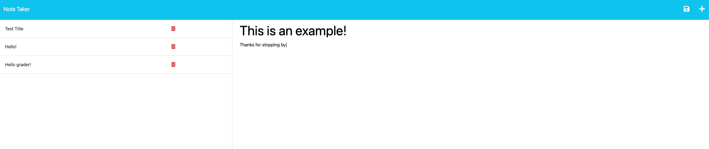
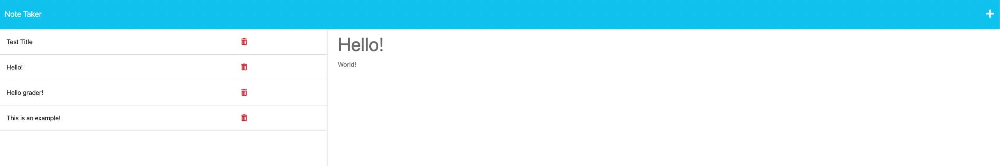

# Note Taker

Store notes, to-do-list items, and more with a persistent database.

# Table of Contents

1. [Installation](#installation)
2. [Usage](#usage)
3. [License](#license)
4. [Contributors](#contributors)
5. [Questions](#questions)

## Installation

      * Navigate to [Note Taker](https://cryptic-citadel-43217-562cc8785c28.herokuapp.com/notes)
      * Click the plus sign in the top right of the page
      * Add a new title and note
      * Click the save button in the top right. You can click on a note on the left hand bar to view a previously saved note

## Usage

## License

Copyright 2023 @corynko

    Permission is hereby granted, free of charge, to any person obtaining
    a copy of this software and associated documentation files (the “Software”),
    to deal in the Software without restriction, including without limitation
    the rights to use, copy, modify, merge, publish, distribute, sublicense,
    and/or sell copies of the Software, and to permit persons to whom the
    Software is furnished to do so, subject to the following conditions:

    The above copyright notice and this permission notice shall be included in
    all copies or substantial portions of the Software.

    THE SOFTWARE IS PROVIDED “AS IS”, WITHOUT WARRANTY OF ANY KIND, EXPRESS OR
    IMPLIED, INCLUDING BUT NOT LIMITED TO THE WARRANTIES OF MERCHANTABILITY,
    FITNESS FOR A PARTICULAR PURPOSE AND NONINFRINGEMENT. IN NO EVENT SHALL THE
    AUTHORS OR COPYRIGHT HOLDERS BE LIABLE FOR ANY CLAIM, DAMAGES OR OTHER
    LIABILITY, WHETHER IN AN ACTION OF CONTRACT, TORT OR OTHERWISE, ARISING FROM,
    OUT OF OR IN CONNECTION WITH THE SOFTWARE OR THE USE OR OTHER DEALINGS IN THE SOFTWARE. -- For More Information, Please Visit https://opensource.org/license/mit/

## Contributors

This project was built by @corynko. If you would like to contribute to this project, please reach out to @corynko.

## Questions

Please don't hesitate to reach out to me at @corynko or open an issue on my repository with any questions or bugs.
